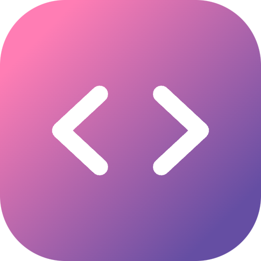

<p align="center">
    
</p>
<h1 align="center">代码截图</h1>
<p align="center">代码截图是一款专业的代码展示工具，能够将源代码转换成精美的图片，让代码分享更加优雅直观。</p>

## Setup

This is a [Next.js](https://nextjs.org/) project. If you're unfamiliar with it, check out the [Next.js Documentation](https://nextjs.org/docs).

To get started, download the repo, install dependencies and run the development server:

```bash
pnpm install
pnpm run dev
```
